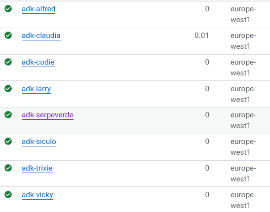

Self: https://github.com/palladius/ai-friendly-agents/

## Agents

My friendly agents:

* 🟢 **Alfred Pennyless** 🦇 (Concierge, able to call other agents). Currently supports (and tested with): Claudia, Larry, Serpeverde, Siculo, Trixie, Vicky.
* 🟢 **Claudia Gugghelheim** ☁️ (Google Cloud agent). Inspired by Cloud: 🔴🔵🟢🟡
* 🟢 **Codie Smulders** 🐍 (code agent). For now, just `built_in_code_execution` from ADK.
* 🟢 **Larry** 🧢  (cURLer / Google). For the moment, just googling 🔎 is implemented.
* 🟢 **Serpeverde** 🧙 (SERP API Executor, basically a Google Search wrapper). For now supports **Maps** 🌍 , **Flights** ✈️ and **Hotels** 🏨 .
  Coming soon: Search 🔎 (for the moment, ask Larry :P)
* 🟢 **Salvatore Siculo** 🧢  (SQL executor and visualizator). Just launched its **v1.0**. fun, safe, and smart!
* 🔶 **Trixie** 📗 (Beatrix “Trixie” Tabularasa) WIP. A Google Sheet agent.
* 🔶 **Vicky** 🟡 (Vicky Pedyah) WIP. A Wikipedia curler on steroids.


More: go/ricc-personal-agents

Coming soon:

* 🔴 **Crudo** (Cloud Run agent). Coming soon.
* 🔴 **Gitti** (`git` agent). Tells you things like "were you drunk when you pushed the latest commit?`. Coming soon.

## Folder structure

```bash
├── agents          # has all agents.
│   ├── alfred      # agent #1
│   ├── claudia     # agent #2
│   ├── codie       # ...
│   ├── hello
│   ├── larry       # DEPLOYABLE
│   ├── serpeverde
│   ├── siculo
│   ├── trixie
│   └── vicky
├── bin
├── lib             # common library code
```

## Genius ideas

I'm considering branching / extending ADK with additional ideas. For example:

1. Adding an array of testable strings, so if I say "test cladia with auto prompts", it iterates those 4 lines .
   For the moment I'm adding a `sample_questions = [ 'My first prompt', ..]` but I'd like to add it into some sort of
   Carlessian constructor like `root = CarlessianAgent( usual_fields, .., sample_questions=my_sample_questions)`.
   Shout if you like this idea.
2. Auto-eval. Building on top of the above, I'd like to have some sort of eval questions. Structure TBD but could be a simple `Hash[str -> str]`.
   This can be easy to auto-test, or maybe use in conjuction with python LLM evalutators, like
   [deepeval](https://github.com/confident-ai/deepeval):

```python
eval_sample_questions = {
  "Whats the weather like today in Zurich?":
    "Make sure the answer is in Centrigrad and NOT fahrenheit (as instructed in the prompt), and it makes sense (between -10 and +40)",
  "What is the date and time today?":
    "Make sure the date is provided and is above 15 may 2025 (which is when this test was written)",
}
```

## Notes on installation

TODO(ricc): move to precipuous folders.

Some agents require additional installation parts (a service account, an API KEY, and so on).

### Trixie

For trixie, you need to:

1. create a service account (say `sa@mail.com`) and store it's key locally, eg under: `private/my-sa-key.json`
2. Then you need to export this as a ENV: `GOOGLE_APPLICATION_CREDENTIALS=private/my-sa-key.json`
3. Finally, you need to share your spreadsheet in READ-ONLY mode to the SA email.

## Serpeverde

* Get a SERP API key in https://serpapi.com

## 🚀 Deploy to Cloud Run

Let's deploy the agent to Cloud Run with the dev UI enabled.

1. First make sure the necessary APIs are enabled: `just deploy-setup-once`.
2. Then, deploy using the adk tool: `just deploy-alfred`

🚦 My personal deploys amount to:

* 🚀🟠 [Alfred](https://adk-alfred-794266741446.europe-west1.run.app/dev-ui) 🔑 IAM error, fixable.
* 🚀🟠 [Claudia](https://adk-claudia-794266741446.europe-west1.run.app/dev-ui) 🔑 403 permission denied on project None.
* 🚀🟠 [Codie](https://adk-codie-794266741446.europe-west1.run.app/dev-ui) 🔑 403 permission denied on project None.
* 🚀🟢 [Larry](https://adk-larry-794266741446.europe-west1.run.app/dev-ui). Works!
* 🚀🔴 [Serpeverde](https://adk-serpeverde-794266741446.europe-west1.run.app/). ⚙️ Error: `{"error": "No module named 'lib'"}`
* 🚀🔴 [Siculo](https://adk-siculo-794266741446.europe-west1.run.app/dev-ui). ⚙️ Launches fine but get syntax error. `lib/` import issue.
* 🚀🟡 [Trixie](https://adk-trixie-794266741446.europe-west1.run.app/dev-ui). 🔗 Error with local .env symlink. Fixing right now.
* 🚀🟠 [Vicky](https://adk-vicky-794266741446.europe-west1.run.app/dev-ui). 🔗 Error@: {"error": "No module named 'bs4'"} Missing beautiful soup => adding it to the dir.

Try this: `just deploy-them-all`.



*  🔵 🟣 🟤 ⚫

This builds a container for the agent and deploys to Cloud Run.
You can visit the default URL of the Cloud Run service to interact with the agent.

### Possible errors

```JSON
{"error": "403 PERMISSION_DENIED. {'error': {'code': 403, 'message': 'Permission denied on resource project None.', 'status': 'PERMISSION_DENIED', 'details': [{'@type': 'type.googleapis.com/google.rpc.ErrorInfo', 'reason': 'CONSUMER_INVALID', 'domain': 'googleapis.com', 'metadata': {'consumer': 'projects/None', 'containerInfo': 'None', 'service': 'aiplatform.googleapis.com'}}, {'@type': 'type.googleapis.com/google.rpc.LocalizedMessage', 'locale': 'en-US', 'message': 'Permission denied on resource project None.'}, {'@type': 'type.googleapis.com/google.rpc.Help', 'links': [{'description': 'Google developers console', 'url': 'https://console.developers.google.com'}]}]}}"}
```

### NOTE on deployment feasibility
[BUG] Currently deploy is limited to self-contained agents (agents who do NOT use `lib/`). This is an `adk` implementation
  limit, but we can override locally by - say - patching the code and copying in a tmp folder like:

```bash
# sample code - dont try iot at home unless you know what you're doing!
mkdir tmp-siculo/
cp -R agents/siculo/  tmp-siculo/siculo/
cp -R lib/            tmp-siculo/siculo/lib/
echo now some black magic sed in siculo/agent.py
adk push tmp-siculo/
```

In alternative, without re-inventing the wheel, I can just elaborate on this `Dockerfile`: https://github.com/google/adk-python/blob/main/src/google/adk/cli/cli_deploy.py#L96
and . Finally, I could package the libraries as some sort of `pip install ricc-friendly-agent-lib`.


**Note**: If the `lib/` dependency is there, deploying such an agent will work but then on exec you'll get a similar error:

```JSON
{"error": "No module named 'lib'"}
```
