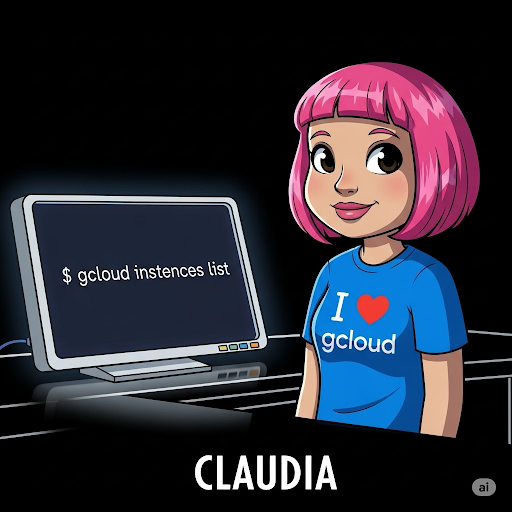
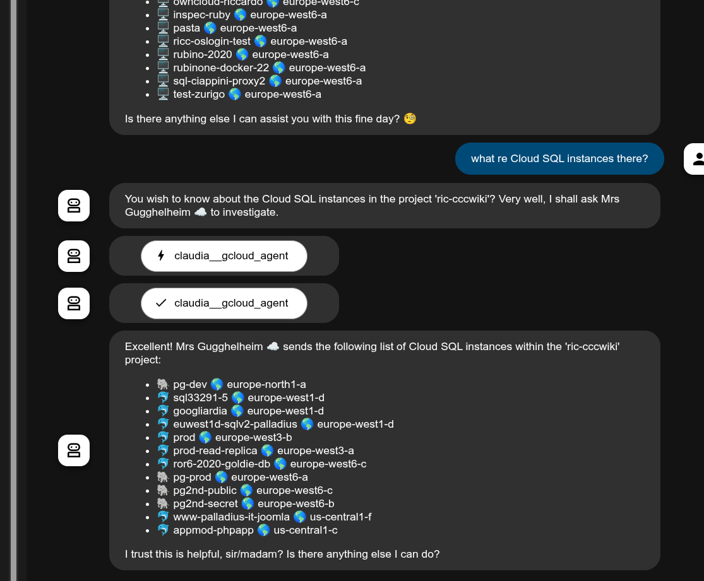

Claudia allows to run generic `gcloud` code ***safely***, to ascertain information about your GCP status.

## Instructions

Make sure you run `gcloud auth login` before running locally.

## Examples

