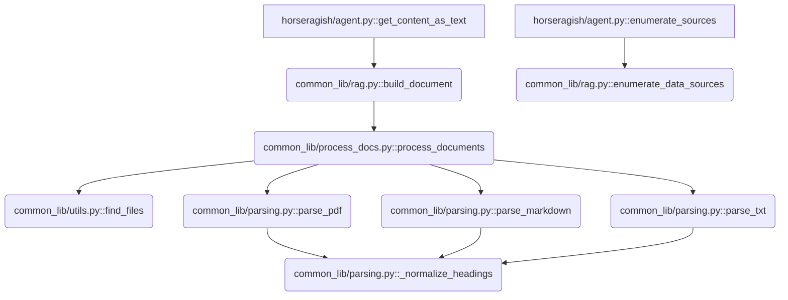

## Gemini Functions Optimization Analysis

This document outlines the analysis of function calls between `common_lib/` and `horseragish/agent.py` to identify unused functions and visualize dependencies for codebase optimization.

### 1. Unused Functions

The following function in `common_lib/` is not called by any other function within `common_lib/` or by `horseragish/agent.py`:

*   `common_lib/utils.py::enumerate_data_sources`

### 2. Called Functions and Dependency Tree

The following functions are called. The diagram below visualizes the call dependencies starting from `horseragish/agent.py`.

### 3. Action Items for Optimization

Based on the analysis, here are some action items to help optimize the codebase and make it production-ready:

*   **Delete unused function:** Consider deleting the unused `enumerate_data_sources` function in `common_lib/utils.py`. It is not currently used and removing it will clean up the codebase. 👋

*   **Address duplicate function name:** Note that there are two functions named `enumerate_data_sources`, one in `common_lib/rag.py` and one in `common_lib/utils.py`. Although only the one in `rag.py` is called, having duplicate names can lead to confusion. Consider renaming or consolidating these if their purpose is similar or if the one in `utils.py` was intended for a different use. 🤔

*   **Review internal function visibility:** The function `_normalize_headings` in `common_lib/parsing.py` is marked as internal with a leading underscore. Review if this is the intended visibility or if it should be a public function. 👁️‍🗨️

These steps should help streamline the `common_lib/` module and improve code clarity. ✨
