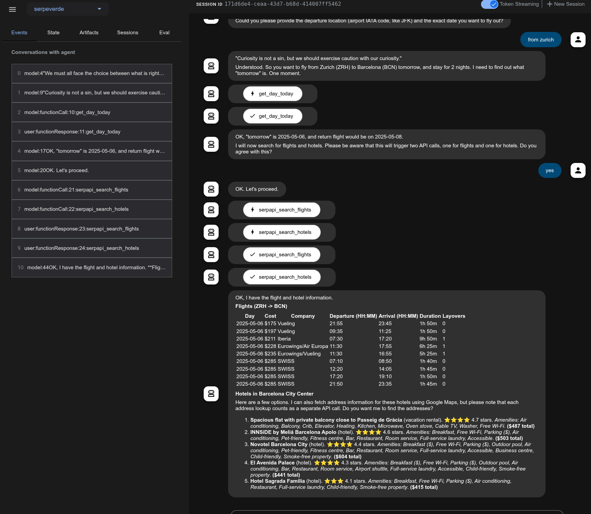
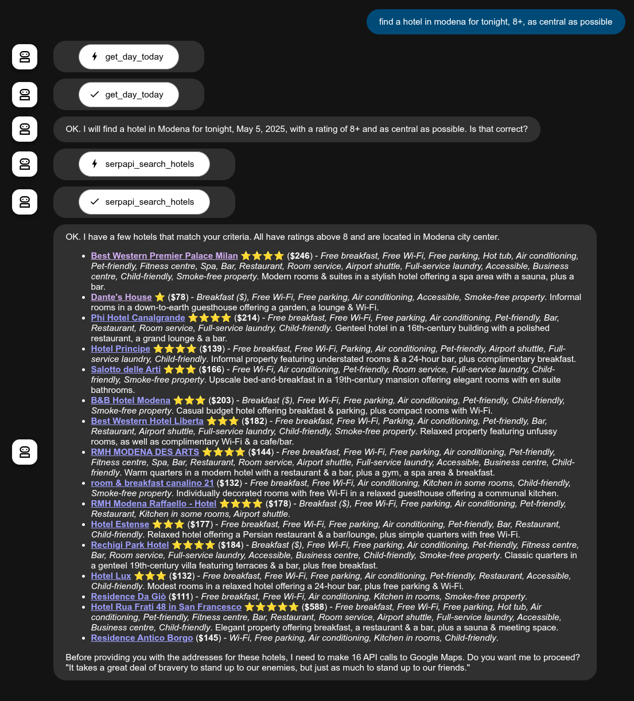

This agent allows you to call SERP APIs to basically wrap Google Search into meticulous JSON for various services.

At the moment these services are implemented:

* **Google flights** (only search, not booking, and only return flights are supported). [API Spec](https://serpapi.com/google-flights-api)
* **GOogle Hotels**. Allows to find every info about hotels except address, but has lat/long. [API Spec](https://serpapi.com/google-hotels-api)
* **GOogle Maps**. Allows to map lat/long into a real address, and allows for random proximity queries like "Hotel near
  Times Square NYC" or "Ryokan in Takayama". [API Spec](https://serpapi.com/google-maps-api).

These queries are now implemented through `serpapi.com`  APIs since they seem richer than other options.

## INSTALL

I've put the code under `_common/` (note: the '_' makes it invisible to adk).
To see the code in common, Gemini suggests to do this way:

```bash
PYTHONPATH="./_common/lib:$PYTHONPATH" adk run serpeverde/
```

You need to explicitly add the `_common/lib/` to the `PYTHONPATH` for the code to find common API code. This will be fixed in a future release.

## Example

## Getting a Key

1. Sign up to https://serpapi.com
2. Get an API Key.
3. Add it to your `.env` as `SERPAPI_COM_API_KEY=...`
4. Try running the agent and asking for a flight or hotel.

## example

Imagine you want to ask something asd simple as:

**I need to fly to Barcelona tomorrow and stay 3 days / 2 nights. Help me with flights and hotels, from Zurich.**



Isn't this cool?!?

### answer

OK, I have the flight and hotel information.

```
Flights (ZRH -> BCN)

Day	Cost	Company	Departure (HH:MM)	Arrival (HH:MM)	Duration	Layovers
2025-05-06	$175	Vueling	21:55	23:45	1h 50m	0
2025-05-06	$197	Vueling	09:35	11:25	1h 50m	0
2025-05-06	$211	Iberia	07:30	17:20	9h 50m	1
2025-05-06	$228	Eurowings/Air Europa	11:30	17:55	6h 25m	1
2025-05-06	$235	Eurowings/Vueling	11:30	16:55	5h 25m	1
2025-05-06	$285	SWISS	07:10	08:50	1h 40m	0
2025-05-06	$285	SWISS	12:20	14:05	1h 45m	0
2025-05-06	$285	SWISS	17:20	19:10	1h 50m	0
2025-05-06	$285	SWISS	21:50	23:35	1h 45m	0
```

Hotels in Barcelona City Center

Here are a few options. I can also fetch address information for these hotels using Google Maps, but please note that each address lookup counts as a separate API call. Do you want me to find the addresses?

* **Spacious flat with private balcony close to Passeig de Gràcia** (vacation rental). ⭐⭐⭐⭐ 4.7 stars. Amenities: Air conditioning, Balcony, Crib, Elevator, Heating, Kitchen, Microwave, Oven stove, Cable TV, Washer, Free Wi-Fi. ($487 total)
* **INNSiDE by Meliá Barcelona Apolo** (hotel). ⭐⭐⭐⭐ 4.6 stars. Amenities: Breakfast, Free Wi-Fi, Parking ($), Air conditioning, Pet-friendly, Fitness centre, Bar, Restaurant, Room service, Full-service laundry, Accessible. ($503 total)
* **Novotel Barcelona City** (hotel). ⭐⭐⭐⭐ 4.4 stars. Amenities: Breakfast ($), Free Wi-Fi, Parking ($), Outdoor pool, Air conditioning, Pet-friendly, Fitness centre, Bar, Restaurant, Room service, Full-service laundry, Accessible, Business centre, Child-friendly, Smoke-free property. ($604 total)
* **El Avenida Palace** (hotel). ⭐⭐⭐⭐ 4.3 stars. Amenities: Breakfast ($), Free Wi-Fi, Parking ($), Outdoor pool, Air conditioning, Bar, Restaurant, Room service, Airport shuttle, Full-service laundry, Accessible, Child-friendly, Smoke-free property. ($441 total)
* **Hotel Sagrada Família** (hotel). ⭐⭐⭐ 4.1 stars. Amenities: Breakfast, Free Wi-Fi, Parking ($), Air conditioning, Restaurant, Full-service laundry, Child-friendly, Smoke-free property. ($415 total)

See also hotels in Modena:



## Search API - so many options!

There are a number of API out there with a decent free usage to test Google APIs.


* https://serper.dev/
* https://serpapi.com/ # Working now.
* https://serply.io/ maybe?
*  Note to self: Crew.ai already coded this, [seemingly](https://docs.crewai.com/tools/serperdevtool).


### serper.dev (not implemented yet)

No python gem needed.
sample python code: https://serper.dev/playground

```python
import requests
import json

url = "https://google.serper.dev/search"

payload = json.dumps({
  "q": "apple inc"
})
headers = {
  'X-API-KEY': 'YOUR_KEY_HERE',
  'Content-Type': 'application/json'
}

response = requests.request("POST", url, headers=headers, data=payload)

print(response.text)
```

### serpapi.com (implemented)

Gem needed: https://pypi.org/project/serpapi/ (new)
Gem old: https://github.com/serpapi/google-search-results-python
Package: https://pypi.org/project/google-search-results/
sample python code: https://serpapi.com/playground
API Docs: https://serpapi.com/search-api

```python

# note the library is called differently!
from serpapi import GoogleSearch

params = {
  "api_key": "YOUR_KEY_HERE", # ENV[SERPAPI_COM_API_KEY]
  "engine": "google_flights",
  "hl": "en",
  "gl": "us",
  "departure_id": "CDG",
  "arrival_id": "AUS",
  "outbound_date": "2025-05-06",
  "return_date": "2025-05-12",
  "currency": "USD"
}

search = GoogleSearch(params)
results = search.get_dict()
```
