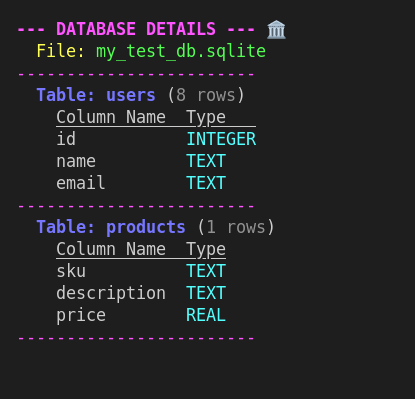

I want to create a sqlite3 DB inspector. Then once it works, I want to extend to PG/MY and other DBs as well.

Note the agent is still TBD.

Self: https://github.com/palladius/ai-friendly-agents/tree/main/adk-prod-agents/siculo

## INSTALL

Nothing to do, really :)

1. Generate fake DB to test script: `just create-db`.
2. Run tests: `just test`. It creates a marvellous colorful listing of the DB.
3. run main script (a swiss army knife to ask questions to a sqlite DB). `python main.py --help`.
    * Or simply `just run` for instant gratification:

## TODOs

Basic functionality is there. Some nice touch I could add:

* Intercept the SQL queries, and if there are, print them
* Memorize the filename in memory, and allow user to change context
* Ability to cache schema and force a refresh upon EXPLICIT user request.
* Show in memory/context the readonly vs not.

## Markdown output from agent.

[salvatore_siculo__sql_agent]: OK. Here is the database schema in markdown format:

## **Database Details** 🏛️
**File:** siculo/my_test_db.sqlite
---
### **Table: users** (4 rows)
| **Column Name** | **Type** |
|:---|:---|
| id | INTEGER |
| name | TEXT |
| email | TEXT |

---

### **Table: products** (2 rows)
| **Column Name** | **Type** |
|:---|:---|
| sku | TEXT |
| description | TEXT |
| price | REAL |
