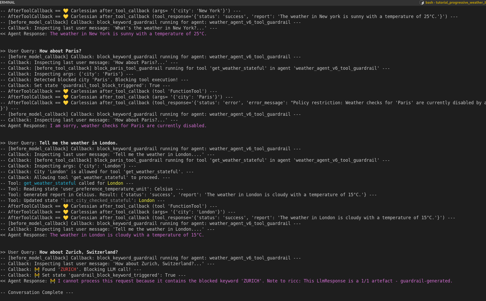

This tutorial is taken by here:

* Tutorial: https://google.github.io/adk-docs/get-started/tutorial/
* Python notebook: https://colab.research.google.com/github/google/adk-docs/blob/main/examples/python/notebooks/adk_tutorial.ipynb
  from [here](https://github.com/google/adk-docs/tree/main/examples/python/notebooks).

## Notes on the code

Since the code is created from a Python notebook, it has a sort of "tridimensionality" to it. Code that works in step 1
needs to be working also in other steps.

I've tried my best to keep:

1. all the common/immutable code in single, testable files.
2. I've tried to keep all "e2e tests" in form of mains which import those lib files.

## TODOs
1. TODO(ricc): when it works, move all the (1) to `lib/` so all testable endpoints become obvious (in `.`).
2. Create an alternative agent to OpenAI and Claude for people who dont have that account.

In `justfile` I tried to keep a mapping between file invokation and title in python notebook. Look at this beauty:

```bash
$ just -l
Available recipes:
    list                   # This list
    run                    # S1.2 -- First weather agent
    test-4-3               # S4.3 -- Redefine Sub-Agents and Update Root Agent with output_key. Uses `s4_session_demo.py`
    test-4-4               # S4.4 -- Interact to Test State Flow and output_key
    test-5-2               # S5.2 -- Update Root Agent with before_model_callback (useless, just constructors)
    test-6-3               # S6.3 -- Test the Tool Guardrail with both BeforeModel and BeforeTool callbacks.
    test-agent-interaction # S3.4 -- Interact with the Agent Team
    test-claude            # S2.2 -- Tests Claude from Anthropic
    test-gpt               # S2.2 -- Tests ChatGPT from "Open"AI
    test-toolz             # S3.1 -- Simply tests get_weather() and say_hello() and goodbye() defined in 3.1 and 3.2
```

## Example

