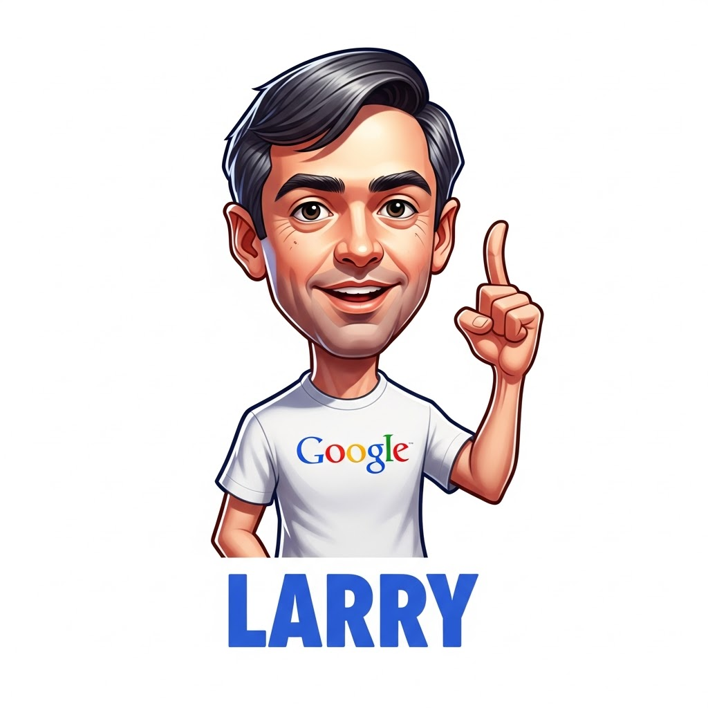
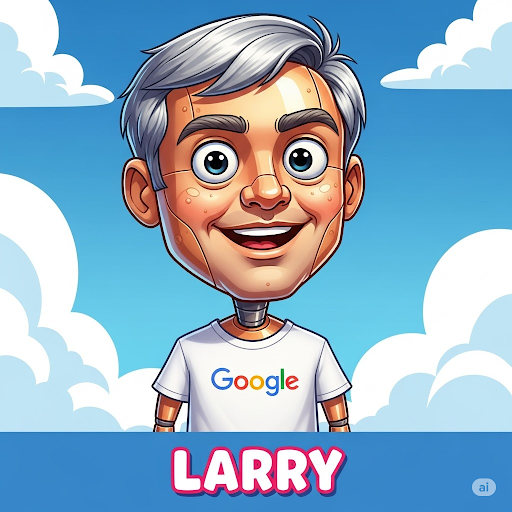

Larry is a simple Googler who calls Google Search for answers.

## Images






trying to add a magnifying glass, but Larry is never clean, this was the best i could get.


redoing it all from scratch:

*make a fun, cartooney image of Larry Page, who is an cute robotic AI agent with a white tshirt showing the google Logo. Below you can read "LARRY". Larry always carries a big magnifying glass in his hand, looking over a big Earth (the internet).*


## Running the Larry 1.0 Agent

This agent has been migrated to ADK v1.0 and uses a dedicated `uv` virtual environment.

**Using the justfile target (Recommended):**

From the `adk/prod/` directory, run:

```bash
just run-larry10-web
```

This command will activate the virtual environment and start the agent using `uvicorn`.

**Manual execution:**

1. Navigate to the agent directory:
   ```bash
   cd adk/prod/agents/larry10/
   ```
2. Activate the virtual environment:
   ```bash
   source .venv/bin/activate
   ```
3. Run with uvicorn:
   ```bash
   uvicorn agent:root_agent --reload
   ```

The agent should be accessible at `http://127.0.0.1:8000`.
