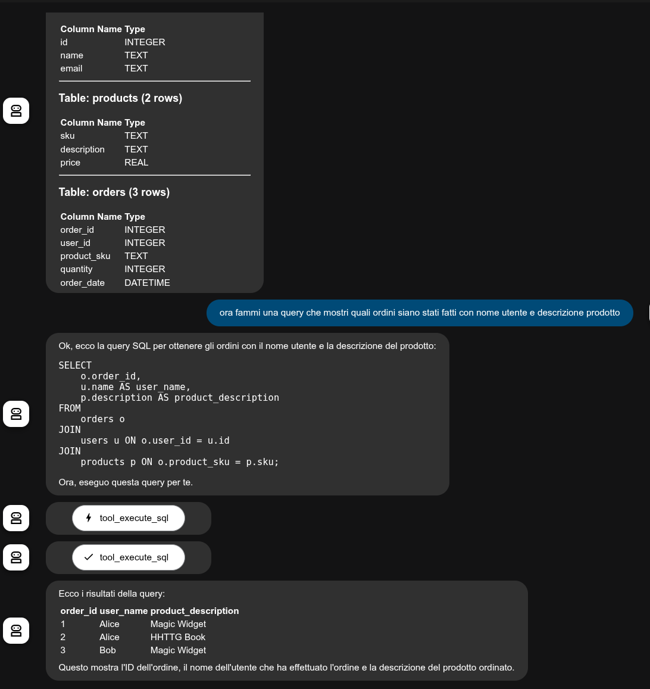

Salvatore Siculo is a `sqlite3` DB inspector.


Self: https://github.com/palladius/ai-friendly-agents/tree/main/adk/prod/siculo


## INSTALL

Nothing to do, really :)

1. Generate fake DB to test script: `just create-db`.
2. Run tests: `just test`. It creates a marvellous colorful listing of the DB.
3. run main script (a swiss army knife to ask questions to a sqlite DB). `python main.py --help`.
    * Or simply `just run` for instant gratification:


## TODOs

Basic functionality is there. Some nice touch I could add:

* Intercept the SQL queries, and if there are, print them in ADK UI mode.
* Memorize the filename in memory, and allow user to change context
* Ability to cache schema and force a refresh upon EXPLICIT user request.
* Show in memory/context the readonly vs not.
* Once it works, I want to extend to PG/MY and other DBs as well.

## Markdown output from agent.

[salvatore_siculo__sql_agent]: OK. Here is the database schema in markdown format:

## <span style="color:#F06292">**Database Details**</span> 🏛️
**<span style="color:#FFF176">File:</span>** <span style="color:#81C784">siculo/my_test_db.sqlite</span>
---
### <span style="color:#64B5F6">**Table: users**</span> (<span style="color:#BDBDBD">4 rows</span>)
| **Column Name** | **Type** |
|:---|:---|
| id | <span style="color:#4DD0E1">INTEGER</span> |
| name | <span style="color:#4DD0E1">TEXT</span> |
| email | <span style="color:#4DD0E1">TEXT</span> |

---

### <span style="color:#64B5F6">**Table: products**</span> (<span style="color:#BDBDBD">2 rows</span>)
| **Column Name** | **Type** |
|:---|:---|
| sku | <span style="color:#4DD0E1">TEXT</span> |
| description | <span style="color:#4DD0E1">TEXT</span> |
| price | <span style="color:#4DD0E1">REAL</span> |

## Sample screenshots from my_test_db.sqlite

Here's the DB schema dump in elegant markdown for `my_test_db.sqlite`:




# Caveats

If you configure Siculo to work from web vs from CLI, you need to configure the CLI slightly differently. Let me show you:

```bash
# Web version, from ./agents/
SICULO_AGENT_DB_FILE=./siculo/google_events.sqlite
cd agents/
adk web # choose siculo from web interface

# CLI version , from ./
SICULO_AGENT_DB_FILE=./agents/siculo/google_events.sqlite
adk run agents/siculo/
```
