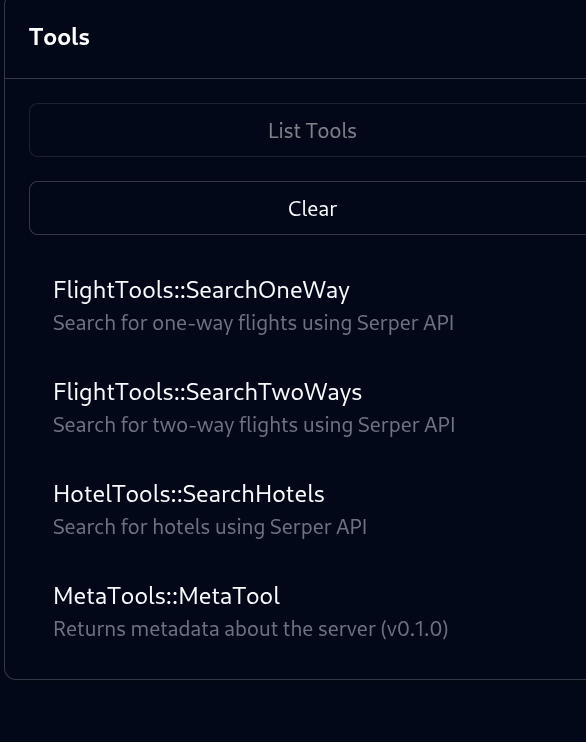

# Ruby Serper MCP Server

This is a simple Ruby MCP server that uses the Serper API to search Google Flights and Google Hotels.

* Type: **SSE**
* Tech: Ruby Sinatra + Puma. Runs on port **9292**.

## Available Tools

*   ✈️ [FlightTools](lib/flight_tools.rb)
    *   **SearchOneWay**(`departure_id`, `arrival_id`, `outbound_date`, *`adults`*, *`currency`*, *`hl`*): Search for one-way flights using Serper API.
    *   **SearchTwoWays**(`departure_id`, `arrival_id`, `outbound_date`, `return_date`, *`adults`*, *`currency`*, *`hl`*): Search for two-way flights using Serper API.

*   🏨 [HotelTools](lib/hotel_tools.rb)
    *   **SearchHotels**(`q`, `check_in_date`, `check_out_date`, *`adults`*, *`children`*, *`rooms`*, *`currency`*, *`hl`*): Search for hotels using Serper API.

*   ℹ️ [MetaTools](lib/meta_tools.rb)
    *   **MetaTool**(): Returns metadata about the server.

## How to Invoke

1.  Copy `.env.dist` to `.env` and fill in your `SERP_API_KEY`.
2.  Run the server using the `justfile` command: `just rack-server`. This will start the server on **port 9292**.

## How to Test

You can test the server using the `justfile` command: `just test-server`

This command sends a `tools/list` request to the server and prints the available tools.
