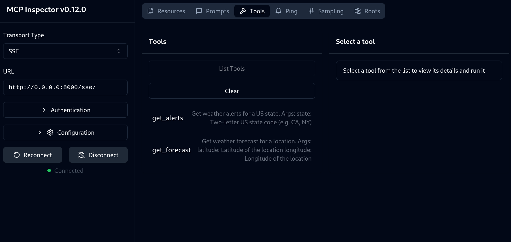
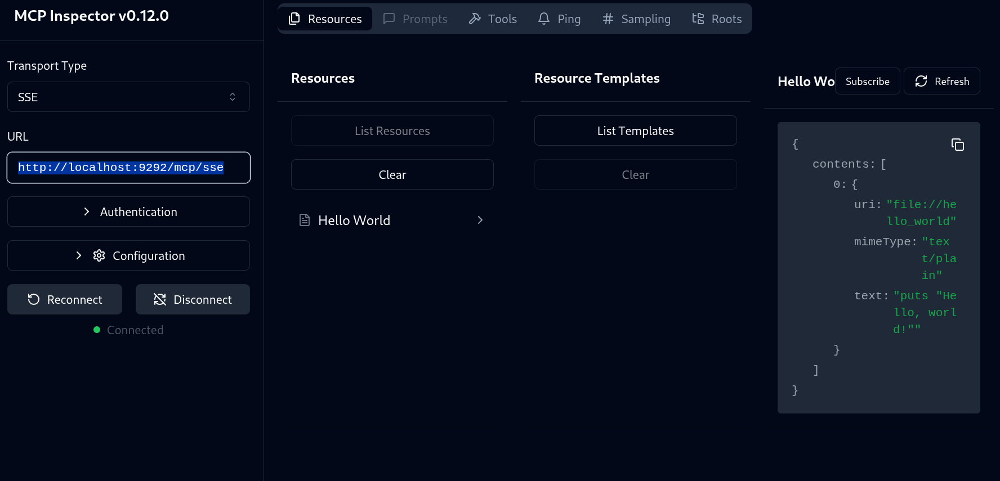

Here are my working MCP servers. Yup, maybe PROD is a big word.

## Working SSE/HTTP servers

**CoC**: Naming in folders respects this convention:

* `{LANGUAGE}-{MCP_TRANSPORT}-[{LIBRARY}-]{SERVICE_NAME}`, for instance:
    * `ruby-sse-my-program/`
    * `python-stdio-my-other-program/`
* If choosing between multiple libraries, I'll prepend the library to the service name, eg let's decompose `ruby-sse-fastmcp-hello-server/`:
    *  Language: **Ruby**
    *  Transport: **SSE**
    *  Gem: `fast-mcp`
    *  Name: `hello-server`.

1. python weather service (`python-sse-weather-server/`):
    * inspection URL : http://0.0.0.0:8000/sse/
    * Screenshot: 

2. Ruby helloworld SSE Server (`ruby-sse-fastmcp-hello-server/`): See README.md
    * Inspection URL: SSE Server IP/Port: http://localhost:9292/mcp/sse
    * Screenshot: 

## Transport

MCP uses JSON-RPC 2.0 as its wire format.

There are 3 forms of transport (poorly defined in [official docs](https://modelcontextprotocol.io/docs/concepts/transports#built-in-transport-types) which only explains 2):

* **STDIO** (stdin/out - no socket is used). Seems the most popular for all devs.. except me.
* **SSE** (network). Love this. I can connect to 10 services just with a `netcat`, and it's language independent.
* **Streamable HTTP** (network).

## Articles

* [Bridging the Gap: Connecting Python AI Agents to Ruby Apps with MCP](https://learnitnow.medium.com/bridging-the-gap-connecting-python-ai-agents-to-ruby-apps-with-mcp-614977012399). Example of multi language MCP system
