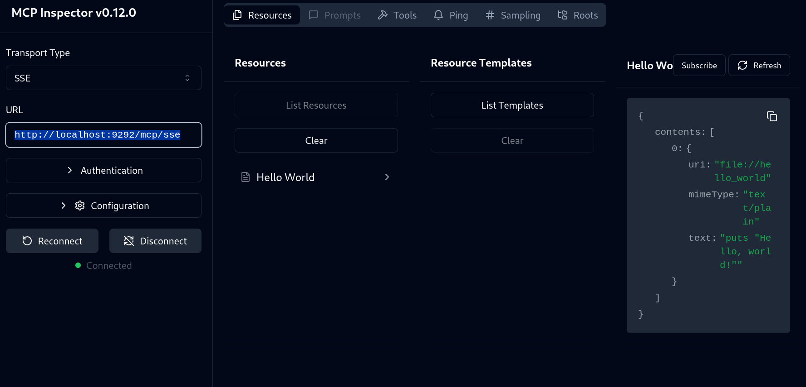
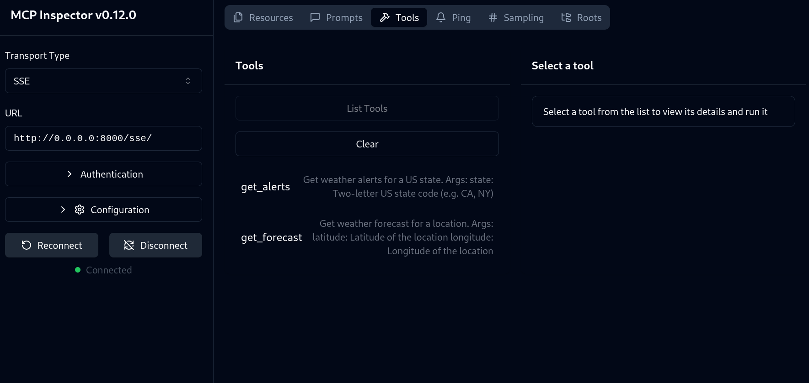

This is Riccardo experimenting with MCP.

Future ideas ([some servers](https://modelcontextprotocol.io/examples#reference-implementations)):

* Try the [GDrive MCP server](https://github.com/modelcontextprotocol/servers/tree/main/src/gdrive)
* Try the [GMaps server](https://github.com/modelcontextprotocol/servers/tree/main/src/google-maps) (typescript)
* Try the [Sqlite server](https://github.com/modelcontextprotocol/servers/tree/main/src/sqlite) (python). Looks like Anthropic is competing with my Siculo :)

## More resources

* Claude desktop for Linux: https://github.com/aaddrick/claude-desktop-debian
* Inspect MCP: `npx @modelcontextprotocol/inspector`

## About MCP

The default protocol seems to be `STDIO`, which is weird. Never seen something like this.

Testing suite (awesome): `npx @modelcontextprotocol/inspector`

* http://127.0.0.1:6274/#resources

1. Ruby inspection (`ruby/fast-mcp-hello-server`): http://localhost:9292/mcp/sse

1.  python inspection (get weather) (`/python/weather-server-sse2/`): http://0.0.0.0:8000/sse/

### Python

The protocol is well documented and well established. Again, all

### Ruby

1. 🟡 [ruby-sdk](https://github.com/modelcontextprotocol/ruby-sdk).(48 🌟) :yellow: The official gem only supports **STDIO**. the gem is not pushed anywhere, so I took the code and pushed it to
  [model_context_protocol_riccardo](https://rubygems.org/gems/model_context_protocol_riccardo), and apologizing here.
    * 🟡 Please see an example server in `ruby-sdk-example-stdio-server/`
1. 🟡 [mcp-rb](https://github.com/funwarioisii/mcp-rb) (178 🌟). :yellow: Very simple gem, oriented to Sinatra. Only supports **stdio** and ping.
    * 🟡 Please see an example server in `mcp-ruby-hello/`
2. ? [mcp_on_ruby](https://github.com/nagstler/mcp_on_ruby) (65 🌟). Seems to support  HTTP and STDIO transports.
    * havent tried it yet.
3. ✅ [fast-mcp](https://github.com/yjacquin/fast-mcp) (619 🌟). Sull of emojis. ✅ Seems to support ALL transports! STDIO, HTTP, and SSE.
    * ✅  Was able to get an SSE server up and running: http://localhost:9292/mcp/sse in `ruby/fast-mcp-hello-server$ bundle exec ruby rack_middleware.rb`

🟡: works but with some limitations (usually only STDIO transport supported).
✅: fully functional
🔴: broken
